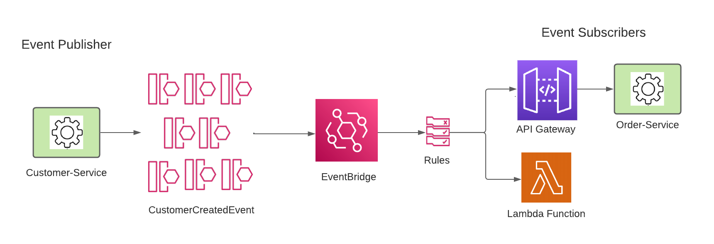

# spring-boot-aws-eventbridge

Event publisher is Customer-Service, which publishes CustomerCreatedEvent to EventBridge. We have defined two targets on the subscriber side, one API Gateway pointing to Order-Service which consumes the CustomerCreatedEvent, the other target is a Lambda function to just print out the event details, merely to demonstrate that we can have multiple targets defined on the subscriber side.

Refer to my Medium article (link to come) for step-by-step instructions required to use AWS EventBridge for pub/sub between two Spring Boot microservices.
